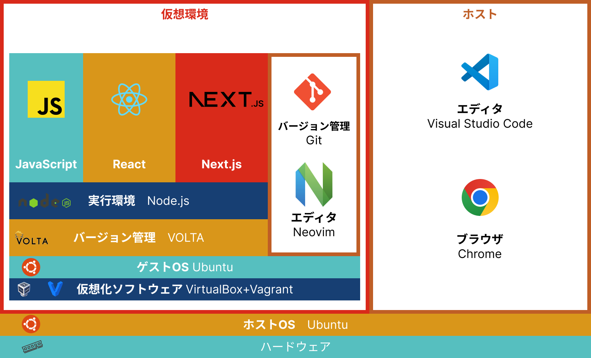

# 環境設定 JavaScript 




vagrantで授業用の仮想環境を作成する
``` terminal
$ mkdir -p ~/Boxes/node && cd $_
$ vagrant init ubuntu/jammy64
$ vagrant box update
```

vagrant設定ファイル編集
``` terminal
$ vi Vagrantfile
```

``` Vagrantfile
26: config.vm.network "forwarded_port", guest: 3000, host: 3000

59: config.vm.provider "virtualbox" do |vb|
60:  #   # Display the VirtualBox GUI when booting the machine
61:  #   vb.gui = true
62:  #
63:  #   # Customize the amount of memory on the VM:
64:     vb.memory = "3064"
65: end
```

仮想環境作成、ログイン
``` terminal
$ vagrant up
$ vagrant ssh
```


## nodeインストール (仮想環境内)

``` terminal
$ sudo apt update -y
$ curl https://get.volta.sh | bash
$ exec $SHELL -l
$ volta install node
$ volta install npm
```
* **[VOLTA](https://volta.sh/)** Nodeのバージョン管理  
* **[npm](https://www.npmjs.com/)** Nodeのパッケージ管理  

## neovim 設定 (仮想環境内)

``` terminal
$ git clone https://github.com/omas-public/settings.git
$ cd ./settings/neovim/
$ ./install_neovim.sh
$ 1) node 2) python3
$ 1
```

neovim アップデート
```
$ sudo apt-get install software-properties-common
$ sudo add-apt-repository ppa:neovim-ppa/stable
$ sudo apt-get update
$ sudo apt-get install neovim
```


neovim プラグインインストール
```
$ nvim

:PlugInstall

```

* **[neovim](https://neovim.io/)** Vim派生テキストエディタ  
* **[JavaScript Standard Style](https://standardjs.com/readme-ja)** コードフォーマッター  
* **[prettier standard](https://www.npmjs.com/package/prettier-standard)** コードフォーマッター  


## GitHub 設定 (仮想環境内)

1. GitHub Tokens発行  
    [GitHubログイン]-[Settings]-[Developer settings]-  
    [Personal access tokens]-[Tokens(classic)]作成  
    Tokensの設定を期限60日、権限範囲 repo, gistにチェック  

2. 作成されたトークンをコピーして大切な場所に保存

3. トークンを自動入力するために「~/.netrc」で設定  
```
$ vi ~/.netrc
```

``` .netrc
machine github.com
login GitHubユーザ名
password トークン
```

4. 仮想環境でのGitの設定

GitHubのアカウント情報を登録
``` terminal
$ git config --global user.email "メールアドレス"
$ git config --global user.name "GitHubアカウント名"
```

ブラウザからGitHubで授業用のリポジトリを新規作成  
**リポジトリ名** WebApp1  
**説明(Description)** WebApplication I JavaScript&React&Next.js  
**公開設定** Public  

仮想環境内にCloneし、README.mdを作成
``` terminal
$ git clone 作成したリポジトリURL
$ cd WebApp1
$ nvim README.md
```

``` README.md
# WebApplication I
JavaScript React Next.js
```

無視リスト(.gitignore)作成

[.gitingnore.io](https://www.toptal.com/developers/gitignore)  
キーワード NextJS react Linux vs  
結果をコピー、「.gitingnore」を作成して  
``` terminal
$ nvim .gitingnore
```
Shift + vで貼り付けして保存して閉じる

作成したファイルをGitHubにプッシュ
``` terminal
$ git branch main
$ git add README.md
$ git add .gitignore
$ git commit -m "Git First Setting"
$ git push origin main
```

ブラウザGitHubでプッシュされたか確認

## neovim上でJavaScriptファイルを実行
```neovim
:!node %
=======
```sh
$ npm install -g standard
$ npm install -g prettier-standard
$ npm install -g jest
$ sudo cat >/etc/sysctl.d/99-max_user_watches.conf << EOF
fs.inotify.max_user_watches=524288
EOF
```

## vscode plugin and module install

```VSCode```

- `ctrl + P` -> `ext install VisualStudioExptTeam.vscodeintellicode`
- `ctrl + P` -> `ext install standard.vscode-standard`
- `ctrl + P` -> `ext install firsttris.vscode-jest-runner`